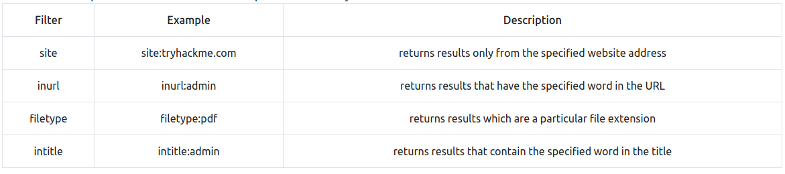

# Manual

The following are the manual methods to get more information on a webpage.

## Detect Frameworks

### Favicon

Using this we can try to find out what framework is being used.

OWASP Favicon database - https://wiki.owasp.org/index.php/OWASP_favicon_database

## Paths

There can be hidden paths on a webpage that might not meet the eye.

### Robots.txt

We know what this is

### Sitemap.xml

Maps all the link on the site that might be difficult to find.

## HTTP Headers

```bash
curl http://MACHINE_IP -v
```

## OSINT

- Google dorks
  - Basic google hacking, things like -
    - 
- Wappalyzer
- Github
- Wayback Machine
- S3 Buckets
  - S3 Buckets are a storage service provided by Amazon AWS, allowing people to save files and even static website content in the cloud accessible over HTTP and HTTPS. The owner of the files can set access permissions to either make files public, private and even writable. Sometimes these access permissions are incorrectly set and inadvertently allow access to files that shouldn't be available to the public. The format of the S3 buckets is http(s)://{name}.s3.amazonaws.com where {name} is decided by the owner, such as tryhackme-assets.s3.amazonaws.com. S3 buckets can be discovered in many ways, such as finding the URLs in the website's page source, GitHub repositories, or even automating the process. One common automation method is by using the company name followed by common terms such as {name}-assets, {name}-www, {name}-public, {name}-private, etc. -- Source : https://tryhackme.com/room/contentdiscovery

# Automated

Ffuf

```bash
ffuf -w /usr/share/wordlists/SecLists/Discovery/Web-Content/common.txt -u http://10.10.169.86/FUZZ
```

Dirb

```bash
dirb http://10.10.169.86/ /usr/share/wordlists/SecLists/Discovery/Web-Content/common.txt
```

Gobuster

```bash
gobuster dir --url http://MACHINE_IP/ -w /usr/share/wordlists/SecLists/Discovery/Web-Content/common.txt
```

# Sub-Domain Enumeration

- Brute Force, 
- OSINT (Open-Source Intelligence) and 
- Virtual Host.

## DNS Brute Force

Tools : 

- dnsrecon

```shell
dnsrecon -t brt -d acmeitsupport.thm
```

## OSINT

### Subdomain from SSL Certificates

- https://crt.sh and 
- https://transparencyreport.google.com/https/certificates

### Subdomain from Google

```
-site:www.tryhackme.com  
site:*.tryhackme.com
```

### Sublist3r

```shell
./sublist3r.py -d acmeitsupport.thm
```

## Virtual Hosts

Some subdomains aren't always hosted in publicly accessible DNS results, such as development versions of a web application or administration portals. Instead, the DNS record could be kept on a private DNS server or recorded on the developer's machines in their /etc/hosts file (or c:\windows\system32\drivers\etc\hosts file for Windows users) which maps domain names to IP addresses.

```ffuf
ffuf -w /usr/share/wordlists/SecLists/Discovery/DNS/namelist.txt -H "Host: FUZZ.acmeitsupport.thm" -u http://MACHINE_IP
```

```
ffuf -w /usr/share/wordlists/SecLists/Discovery/DNS/namelist.txt -H "Host: FUZZ.acmeitsupport.thm" -u http://MACHINE_IP -fs {size}
```

